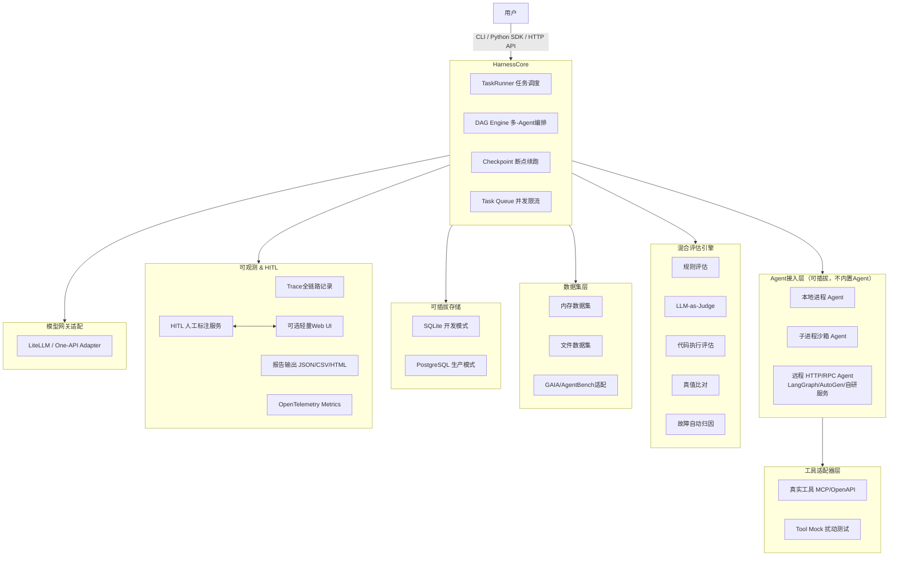

# 架构概览

## 整体架构图

## 关键设计约束

1. **不实现业务 Agent**：只定义 Agent 调用接口，被测对象来自外部。
2. **UI 是可选组件**：核心逻辑不依赖前端，可以纯 CLI / SDK 使用。
3. **模型网关不重复造轮子**：做 LiteLLM/One‑API 的适配器，不自己实现模型负载均衡。
4. **存储可插拔**：开发 SQLite 零配置，生产切换 PostgreSQL。
5. **沙箱安全默认关闭**，文档明确风险。
6. **所有扩展点都是抽象基类接口**，用户继承即可自定义，不需要修改框架源码。
